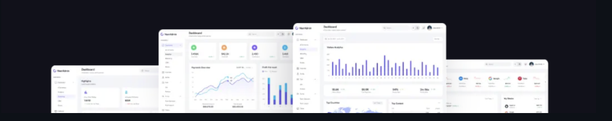

# Admin Point Dashboard - Ecommerce Solution

**Admin Point Dashboard** is a powerful, open-source Next.js admin toolkit featuring 200+ UI components and templates. It comes with pre-built elements, components, pages, high-quality design, and integrations to help you manage your e-commerce platform with ease.

## Developed and Personalized by: **Muhammad Adil**

This project has been customized to serve as a comprehensive admin solution for e-commerce needs, featuring a personalized identity and branding.

## Highlighted Features
- **200+ Dashboard UI Components**: Professional elements crafted with high-quality design.
- **Next.js 16 & React 19**: Leveraging the latest web technologies for optimal performance.
- **Tailwind CSS Styling**: Modern, clean, and highly customizable UI.
- **Dark & Light Mode**: Built-in support for multiple themes.
- **Responsive Design**: Works perfectly across mobile, tablet, and desktop.
- **TypeScript Reliability**: Reducing bugs and ensuring top-tier code quality.
- **Charts and Analytics**: Integrated ApexCharts for real-time data visualization.

## Contact Information
- **Name**: Muhammad Adil
- **Email**: adil.mern.ai@gmail.com
- **LinkedIn**: [in/muhammad-adil-code](https://linkedin.com/in/muhammad-adil-code)
---
*Happy Coding!*
